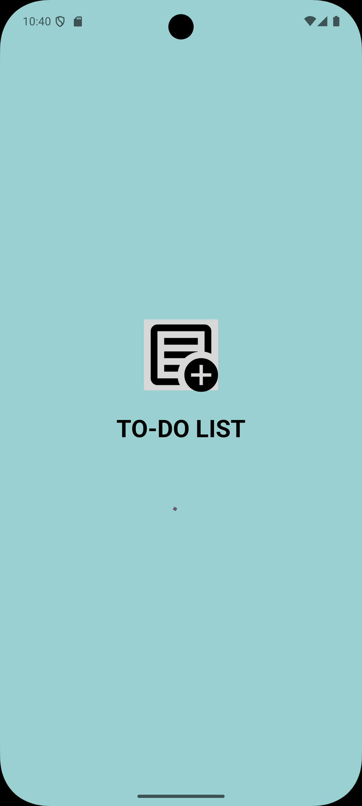
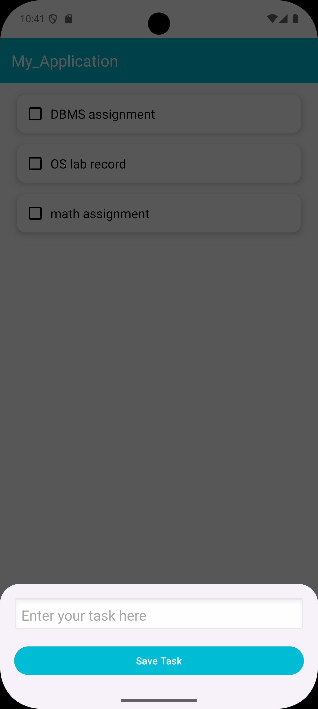
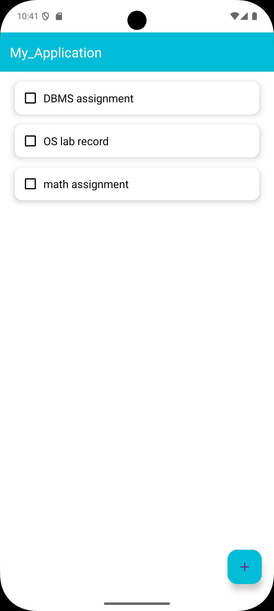
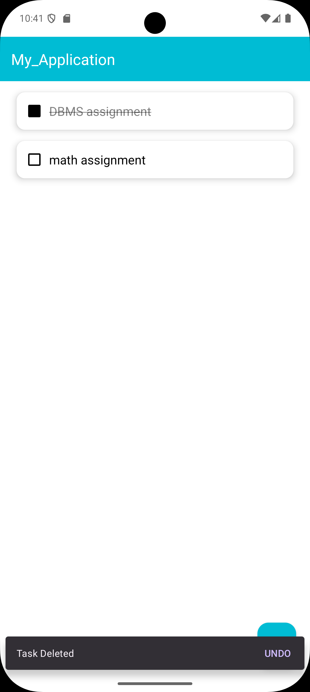

# To-Do List Android App

A simple and clean To-Do List application built using Java and Android Studio.

## Features
- Add Tasks
- Edit Tasks
- Mark Complete
- Delete Tasks
- Instant UI Updates
- SQLite Local Storage

## Tech Used
- Java
- RecyclerView
- SQLite
- Material Design

Built by 
-Lovely 
# App Preview

